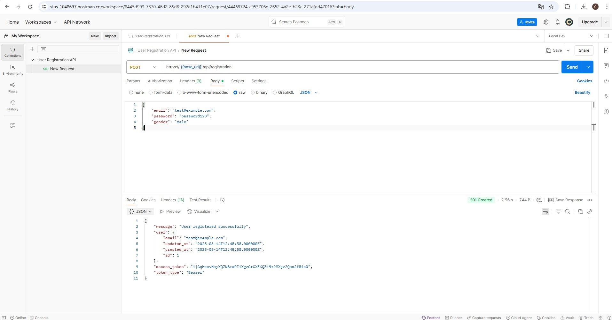

# User Registration API

Простое REST API для регистрации и управления профилями пользователей, реализованное на Laravel.

## Требования

- PHP 8.0+
- Laravel 9.x

## Локальная установка

```
git clone https://github.com/StanislavSol/user-api.git
cd user-api
make install
```

## Запуск приложения

```
make start
```
## Документация API

Postman коллекция: [UserAPI.postman_collection.json](/docs/UserAPI.postman_collection.json)

## Примеры запросов из Postman

## 1. Регистрация пользователя

  
*POST /api/registration - регистрация нового пользователя*

## 2. Получение профиля

  
*GET /api/profile - запрос данных профиля*
